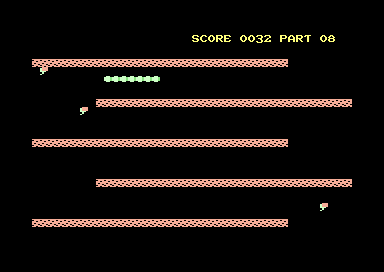

# snake6502



*snake6502* is a snake-like game clone for Commodore home computers, written for fun because «I always wanted to code something for a computer of my retrocomputers collection – actually, this is the main reason I collect them: to write programs».

Download the [binary .prg](dist/snake.prg).

## Compile
You need the GNU compiler collection and the [dasm](https://dasm-assembler.github.io/) macro assembler, then:
```
$ make
```
You can also make it output useful extra info with:
```
$ make debug
```

## Developer docs
### Memory map
Address               | PRG   | Description
----------------------|-------|------------
```$0000 - $0001```   | no    | hardware
```$0002 - $00FF```   | no    | zero page pointers
```$0100 - $07FF```   | no    | *free ram*
```$0800 - $0FFF```   | yes   | initialized data segment (incl. const) + BASIC autostart
```$1000 - $1FFF```   | yes   | SID tune
```$2000 - $27FF```   | yes   | custom char
```$2800 - $xxxx```   | yes   | program logic (only needed part used)
```$xxxx - $CCFF```   | no    | *free ram*
```$CD00 - $CDFF```   | no    | data segment (not-initialized vars)
```$CE00 - $CEFF```   | no    | list X
```$CF00 - $CFFF```   | no    | list Y
```$D000 - $DFFF```   | no    | I/O
```$E000 - $FFFF```   | no    | Kernal

### Custom charset
Index           | Description
----------------|-------------
```$00 - $1F``` |   A-Z (space first)
```$20 - $3F``` |   A-Z, reversed (space first)
```$40 - $4F``` |   hex digits
```$50 - $5F``` |   hex digits, reversed
```$60 -    ``` |   game tiles

