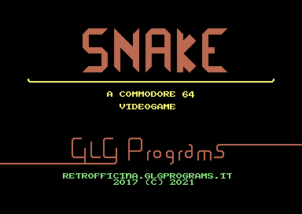

# snake6502




*snake6502* is a snake-like game clone for Commodore home computers, written for fun because «I always wanted to code something for a computer of my retrocomputers collection – actually, this is the main reason I collect them: to write programs».

Current development status [here](https://git.giomba.it/giomba/snake6502).

## Download
* [.d64](dist/snake6502.d64) for floppy disks
* [.bin](dist/snake6502.bin) for 8KiB cartridges

## Compile
You need the GNU compiler collection and the [dasm](https://dasm-assembler.github.io/) macro assembler, then:
```
$ git submodule init
$ git submodule update
$ make
```
Interesting targets:

* ```make bin/snake6502.bin``` produces .bin, ready to be burnt on an 8K EEPROM for making a cartridge
* ```make bin/snake6502.d64``` produces .d64, ready to be used for floppy disks

You can also define the following environment variables:

```$ DEBUG=1 make```        build with debugging artifacts

## Tape
Copy ```loader.prg``` and ```packlz``` from disk to tape.
On a physical machine, you can use [disk2tape](https://git.giomba.it/giomba/cbmutil).

## Developer docs
### Package
The whole program is assembled into a ```snake.pack``` binary blob with the following structure.

Absolute    | Offset      | Description
------------|-------------|------------
```$1000``` | ```$0000``` | load address
```$2800``` | ```$1800``` | entry point (start address)

### Memory map
Address               | PRG   | Description
----------------------|-------|------------
```$0000 - $0001```   | no    | hardware
```$0002 - $00FF```   | no    | zero page pointers
```$0100 - $01FF```   | no    | stack page
```$0200 - $03FF```   | no    | operating system variables
```$0400 - $07FF```   | no    | video memory
```$1000 - $1FFF```   | yes   | SID tune, may overlap charset
```$2000 - $23FF```   | yes   | custom char, unused, allow SID overlap
```$2400 - $27FF```   | yes   | custom char (actual 0x80+)
```$2800 - $xxxx```   | yes   | Program segment (only needed part used)
```$xxxx - $CCFF```   | no    | *free ram*
```$CD00 - $CFFF```   | no    | data segment (not-initialized vars)
```$D000 - $DFFF```   | no    | I/O
```$E000 - $FFFF```   | no    | Kernal

### Compression
```snake.pack``` is compressed into ```snake.pack.lz``` using [liblzg](https://github.com/mbitsnbites/liblzg), to save space, mainly in order to fit the game in a *PROM.
Decompression occurs with one of the following loaders.

### Loader
#### Cartridge
```cart.asm``` is located at ```$8000``` (standard org address for C64 cartridges), and contains the decompression routine and the ```snake.pack.lz```. It decompresses ```snake.pack.lz``` back to ```$1000```, and jumps to its entry point at ```$2800```.
#### Disk
```loader.asm``` loads at ```$801```, like any other BASIC automatic runner, and contains the decompression routine.
```snake.pack.lz``` is loaded at ```$8000``` from disk drive, then decompressed back to ```$1000```, and finally the loader jumps to the program entry point at ```$2800```.

### Miscellanea
#### Custom charset
Index           | Description
----------------|-------------
```$00 - $7F``` |   unused (space for SID)
```$80 - $9F``` |   A-Z (space first)
```$A0 - $BF``` |   A-Z, reversed (space first)
```$C0 - $CF``` |   hex digits
```$D0 - $DF``` |   hex digits, reversed
```$E0 - $EF``` |   game tiles
```$F0 - $FF``` |   semigraphic tiles

##### Semigrahic Tiles
Char      | Output
----------|--------
```$F0``` | ```◜```
```$F1``` | ```◝```
```$F2``` | ```◟```
```$F3``` | ```◞```
```$F4``` | ```-```
```$F5``` | ```|```
```$F6``` | ```◢```
```$F7``` | ```◣```
```$F8``` | ```◥```
```$F9``` | ```◤```
```$FA``` | ```┴```
```$FB``` | ```┬```
```$FC``` | ```┤```
```$FD``` | ```├```

